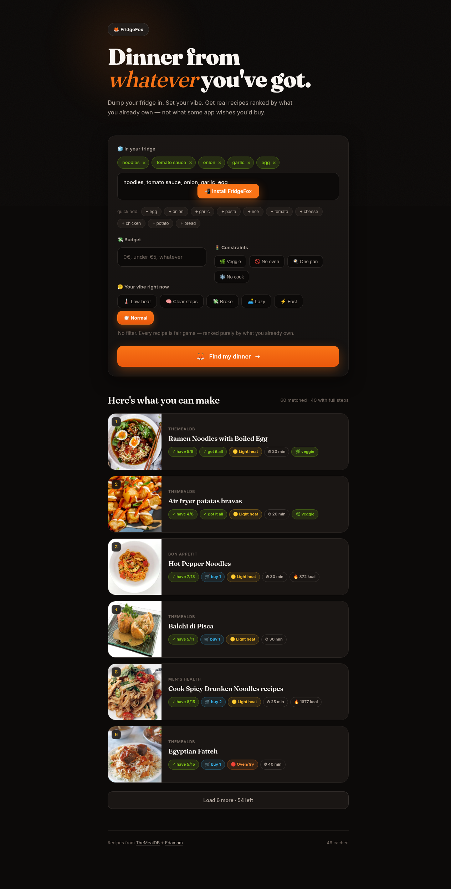

# 🦊 FridgeFox

**Dinner from whatever you've got.** Dump your fridge contents and a budget, get a ranked list of *real* recipes you can actually make — grounded in real recipe APIs, never hallucinated.



## Why it exists

Most "AI recipe" apps just ask a language model to invent a recipe. It cheerfully hallucinates quantities, invents steps, and pushes you toward expensive dishes. FridgeFox does the opposite:

- **Recipes come from real databases** — [TheMealDB](https://www.themealdb.com) and [Edamam](https://www.edamam.com). Every recipe is a real one with a real source link.
- **Ranking is 100% deterministic math.** No LLM decides what floats to the top. You're ranked purely by how much of each recipe you already own, heat needed, and how little you'd have to buy.
- **The LLM does exactly one job:** the optional *Adapt steps* button rewrites the method for a chosen mode (low-heat, clear-steps, broke, lazy, fast). It never invents a recipe.
- **Honest about data.** Edamam recipes show nutrition; TheMealDB recipes show full steps. Each hides what it genuinely lacks instead of faking it.

## Features

- 🧊 **Fridge-first ranking** — type what you have, see what needs the fewest extra purchases
- 🔬 **Real nutrition** — per-serving macros on recipes that have them (via Edamam)
- 🧠 **Accessibility / neurodivergent modes** — clear-steps mode gives exact times and one action per step; low-heat, broke, lazy, and fast modes too
- ⚡ **Resilient** — if one source is rate-limited, the other carries the search; a dead API falls back to stale cache instead of blanking the page
- 📲 **Installable PWA** — works offline for previously-seen recipes, network-first for code
- 🔗 **Deep-linkable** — every recipe has a shareable URL that survives a refresh

## Setup

```bash
# 1. clone
git clone https://github.com/taynotfound/fridgefox.git
cd fridgefox

# 2. add your keys
cp config.example.js config.js
#   then edit config.js:
#   • OpenRouter key  → https://openrouter.ai/keys   (Adapt steps only)
#   • Edamam id+key   → https://developer.edamam.com  (recipe search + nutrition)
#   TheMealDB needs no key.

# 3. serve (any static server)
python3 -m http.server 8877
#   open http://localhost:8877
```

`config.js` is gitignored — your keys never get committed.

> **Note on keys:** this is a fully client-side app, so any key it uses is visible in the browser. Use free-tier keys with tight rate limits, and rotate them if abused. Don't put a paid key in here.

## Architecture

```
index.html      markup + PWA wiring
style.css       editorial dark-foodie theme (Fraunces + Inter, ember palette)
config.js       your keys + the cache/fetch layer  (gitignored)
config.example.js   template — copy to config.js
sources.js      TheMealDB + Edamam adapters, normalisation
app.js          state, ranking math, rendering, routing, Adapt-steps LLM call
sw.js           service worker: network-first shell, cache-first images
```

**Ranking** lives entirely in `app.js` (`scoreRecipe`) — pure arithmetic over ingredient overlap, staples, heat, and buy-count. Swap in your own weights without touching any model.

## License

MIT — do whatever, just don't blame the fox if dinner's weird.
